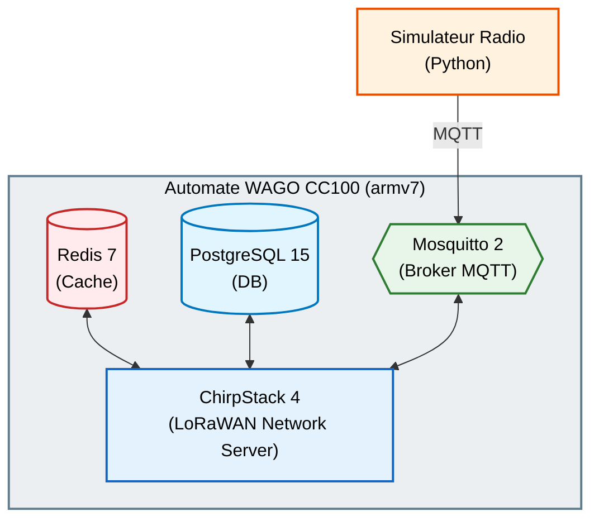

# Docker Automate — LoRaWAN Stack on WAGO CC100


> **Déploiement automatisé d'une stack LoRaWAN (ChirpStack v4) via Docker sur un automate industriel WAGO CC100.**
>
> Ce projet fournit des scripts d'installation, de simulation de capteurs et de benchmark de performance.

---

## Table des matières

- [Architecture](#architecture)
- [Prérequis](#prérequis)
- [Installation rapide](#installation-rapide)
- [Structure du projet](#structure-du-projet)
- [Scripts principaux](#scripts-principaux)
- [Benchmark & Stress Test](#benchmark--stress-test)
- [Documentation](#documentation)
- [Licence](#licence)

---

## Architecture



---

## Prérequis

| Composant       | Version minimale |
|-----------------|-----------------|
| Python          | 3.10+           |
| Docker          | 20.10+          |
| Docker Compose  | v2+             |

---

## Installation rapide

### 1. Cloner le dépôt

```bash
git clone https://github.com/Princeddn/Docker_automate.git
cd Docker_automate
```

### 2. Installer les dépendances Python

```bash
python -m venv .venv
source .venv/bin/activate   # Linux/Mac
# .venv\Scripts\activate    # Windows
pip install -r requirements.txt
```

### 3. Déployer la stack sur le WAGO

```bash
# Lancer l'installation automatisée (le script est dans config/)
bash config/install_lora.sh
```

---

## Structure du projet

```
Docker_automate/
├── .env                            # Fichier de configuration (Clés API, identifiants MQTT)
├── scripts/
│   ├── simulators/                 # Générateurs de trames et capteurs virtuels
│   ├── benchmark/                  # Orchestrateurs de tests de charge (Ramp-Up, DDoS)
│   └── tools/                      # Diagnostics, écoute MQTT et scripts de monitoring
├── config/                         # Fichiers TOML, YAML et shell (Install WAGO)
├── docs/                           # Documentation
│   └── DOCUMENTATION.md            # Rapport global et manuel technique unifié
├── requirements.txt                # Dépendances Python
└── Readme.md                       # Ce fichier
```

---

## Scripts principaux

### Gestion des capteurs

| Script | Description |
|--------|-------------|
| `scripts/simulators/01_creation_capteurs.py` | Crée automatiquement des devices LoRaWAN dans ChirpStack via l'API gRPC |
| `scripts/simulators/00_suppression_capteurs.py` | Supprime les capteurs de test de ChirpStack |

### Simulation radio

| Script | Description |
|--------|-------------|
| `scripts/simulators/02_simulateur_radio.py` | Envoie des trames LoRaWAN simulées via MQTT |
| `scripts/simulators/02_simulateur_radio_verif.py` | Version avec vérification stricte de la réception |
| `scripts/simulators/simulateur_capteurs.py` | Simulation multi-capteurs complète |

### Monitoring

| Script | Description |
|--------|-------------|
| `scripts/tools/mqtt_monitor.py` | Écoute et analyse le trafic MQTT en temps réel |
| `scripts/tools/enregistreur_csv.py` | Enregistre les données reçues en CSV |
| `scripts/tools/monitor_ssh_wago.py` | Surveillance du WAGO via SSH |

---

## Benchmark & Stress Test

Le projet inclut un système complet de benchmark progressif :

```bash
# Lancer le benchmark complet (ramp-up de 1 à N capteurs)
python scripts/benchmark/master_benchmark.py

# Test de crash / saturation
python scripts/benchmark/benchmark_crash.py
```

Les conclusions de ces tests sont documentées et consolidées dans le manuel technique complet.

---

## Documentation

La documentation unifiée et mise à jour est disponible dans le dossier [`docs/`](docs/) :

- **[Manuel Technique Complet (DOCUMENTATION.md)](docs/DOCUMENTATION.md)** : C'est le grand rapport global qui détaille l'ensemble du projet (architecture, analyse matérielle, déploiement, configuration, incidents, et résultats des benchmarks).
- [Guide d'installation rapide](docs/installation.md)
- [Guide de configuration ChirpStack](docs/configuration.md)
- [Guide de configuration Gateway RAK](docs/gateway_configuration.md)

*(Note : Le manuel PDF du capteur physique se trouve également dans ce dossier).*

---

## Bibliographie et Références

### Spécifications et Protocoles
* **LoRa Alliance** - *LoRaWAN® Specification v1.0.3 et v1.0.4*. Spécifications fondamentales du protocole réseau, de l'architecture de sécurité (AES-128, MIC) et du fonctionnement des couches MAC. [lora-alliance.org](https://lora-alliance.org/)
* **Semtech Corporation** - *Semtech UDP Packet Forwarder Protocol*. Spécifications de la communication de bas niveau entre la passerelle radio et le serveur réseau. [github.com/Lora-net/packet_forwarder](https://github.com/Lora-net/packet_forwarder)

### Logiciels et Infrastructures
* **ChirpStack v4** - *Documentation officielle*. Architecture, configuration TOML des régions, et intégration MQTT du Network Server open-source. [www.chirpstack.io](https://www.chirpstack.io/docs/)
* **Docker** - *Docker Engine & Docker Compose Documentation*. Bonnes pratiques de conteneurisation, gestion des networks isolés, et directives de healthchecks. [docs.docker.com](https://docs.docker.com/)
* **Eclipse Mosquitto** - *Mosquitto MQTT Broker Documentation*. Configuration de la persistance, routage et gestion des topics MQTT. [mosquitto.org](https://mosquitto.org/)
* **Redis** - *Documentation de la persistance Redis*. Principes de la sauvegarde AOF (Append Only File) et optimisation de la mémoire cache. [redis.io](https://redis.io/docs/management/persistence/)

### Matériel (Hardware)
* **WAGO Corporation** - *Manuel du WAGO Compact Controller 100 (CC100)*. Architecture matérielle du processeur ARM Cortex-A8 600 MHz, capacités de la RAM et OS Linux embarqué. [www.wago.com](https://www.wago.com/)
* **RAKwireless** - *Documentation de la passerelle RAK7268 (WisGate Edge Lite 2)*. Configuration du système OpenWRT intégré, gestion du Built-in Network Server et désactivation du Packet Forwarder interne. [docs.rakwireless.com](https://docs.rakwireless.com/)

### Benchmarking et Outillage
* **Eclipse Paho MQTT** - *Bibliothèque Python Paho MQTT*. Utilisée pour l'injection automatisée des trames dans les scripts de tests en charge (Ramp-Up). [pypi.org/project/paho-mqtt](https://pypi.org/project/paho-mqtt/)
* **Kernel Linux** - *Documentation des paramètres Sysctl*. Compréhension du `vm.overcommit_memory` et de la gestion de l'OOM Killer (Out Of Memory) sur les systèmes à faible mémoire RAM. [kernel.org](https://www.kernel.org/doc/Documentation/sysctl/vm.txt)

---

## Licence

Ce projet est sous licence MIT. Voir le fichier [LICENSE](LICENSE) pour plus de détails.

---

<p align="center">
  <strong>Projet réalisé dans le cadre d'un déploiement Docker sur automate industriel WAGO CC100</strong>
</p>
